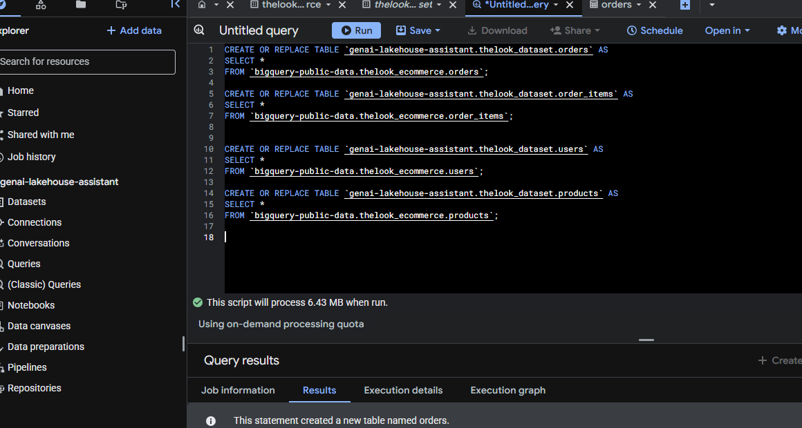
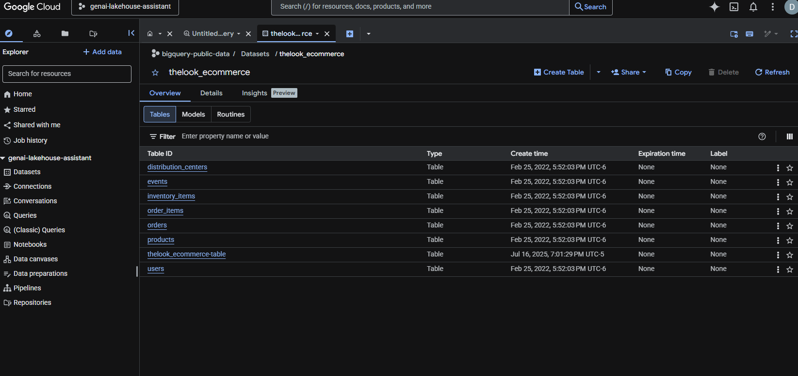

## Data:
I have used public data set from bigquery for testing the code. 
You can use any public dataset or your own dataset in bigquery for testing the code. Just make sure to update the project_id and dataset_id in the code accordingly.
### public data -
- theLook eCommerce:
    -BigQuery Public Data
    -Synthetic eCommerce and Digital Marketing data

## Adding dataset to your database:
1. Create a project
    * project_ID : genai_lakehouse-assistant
2. Assign roles in IAM on google cloud
    *Roles:
        - Bigquerry Data owner
        - Bigquerry Data Editor
        - Bigquerry Data Viewer
        - VertexAI user
        
3. Copy the json permission key to your local machine.
4. Create tables in your database from thelook ecommerse public database
    * Databse_ID = thelook_dataset

5. Tables created :
    - inventory_items
    - order_items
    - users
    - products
    - orders

### Google Cloud DataLake Data
Chat bot provides an option to create external table using gc uri's (csv,json,parquets etc)
- data used here - gs://sureskills-lab-dev/DAC2M2L4/returns/returns_*.parquet
- file type - PARQUET

